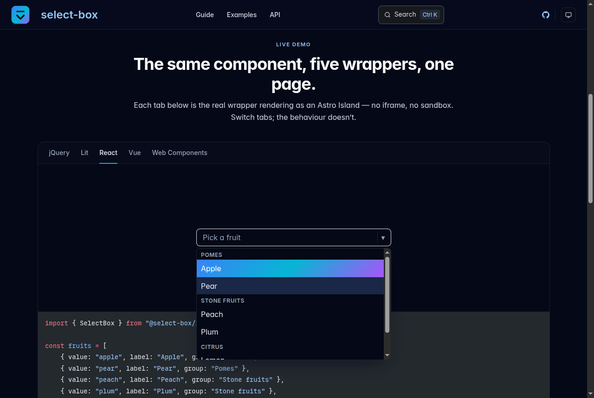

<p align="center">
  
</p>

<h1 align="center">select-box</h1>

<p align="center">
  <strong>One select box. Every framework.</strong><br>
  Search, virtualization, keyboard navigation and ARIA live in a framework-agnostic
  core. React, Vue, Lit, Web Components and jQuery are thin adapters over it — same
  snapshot, same behaviour, every bug fixed once.
</p>

<p align="center">
  
  ·
  
  ·
  
  ·
  
  ·
  
</p>

<p align="center">
  <a href="https://giovani-freitag.github.io/select-box/"><strong>Open the live demo →</strong></a><br>
  <sub>Five wrappers rendering on one page. No iframe, no sandbox.</sub>
</p>

<p align="center">
  
</p>

Most select libraries are welded to one framework. A stack that mixes React with a
Vue widget and a legacy jQuery admin ends up shipping three select boxes with three
different keyboard quirks and three different accessibility holes. This one splits
**state and behaviour** from **rendering**, so a fix lands in the core and every
wrapper gets it in the same commit.

## ✨ Features

- 🧠 **Framework-agnostic core** — one controller owns search, filtering, virtualization, keyboard nav and ARIA. Observer store, TanStack-style.
- 🔁 **Identical API in all five** — `useSelectBox()`, `<select-box>` and `$.fn.selectBox()` take the same config and publish the same snapshot fields.
- ♿ **WAI-ARIA combobox, built in** — roles, `aria-activedescendant`, focus management and accessible names, asserted against the browser's own accessibility tree.
- 📋 **Native form control** — `disabled`, `readOnly`, `name` and `required` everywhere, submitted through `ElementInternals` or a mirrored native `<select>`. Reset restores the default, the way the platform does.
- ⚡ **10 000 options, windowed** — measured virtualization over `@tanstack/virtual-core`, variable row heights included.
- 🗂️ **Option groups** — `<optgroup>` parity, with navigation that skips headers and disabled rows.
- 🎯 **Single, multi, popover, inline chips** — cardinality and surface are orthogonal flags, switchable at runtime.
- 🔌 **Seven opt-in addons** — fuzzy matching, hoist selected, clear button, create option, remove button, restore on backspace, persistence. Hooks are pure transformers, so reentrancy is structurally impossible.
- 🎨 **One stylesheet, themed by tokens** — restyling is redefining `--sb-*` custom properties, not overriding rules.
- 🪜 **Two tiers per wrapper** — drop in the styled component, or take the headless controller and render your own markup.
- 🧪 **630 matrix specs** — 70 parity scenarios and 56 browser specs run against every wrapper, so cross-framework drift fails a column instead of reaching users.

## 🚀 Quick start

```bash
pnpm add @select-box/core @select-box/react @select-box/styles   # swap /react for /vue, /lit, /webcomponents, /jquery
```

> Not on a registry yet. Until it is, consume it from a checkout — `pnpm link` or a
> git dependency on a release tag. The package names above are the ones it will publish under.

### React

```tsx
import { SelectBox } from "@select-box/react";
import "@select-box/styles";

const fruits = [
    { value: "apple", label: "Apple", group: "Pomes" },
    { value: "pear", label: "Pear", group: "Pomes" },
    { value: "lemon", label: "Lemon" },
];

export function App() {
    return (
        <SelectBox
            options={fruits}
            placeholder="Pick a fruit"
            ungroupedLabel="Citrus"
            onChange={(value) => console.log(value)}
        />
    );
}
```

### Web Components

```html
<select-box id="fruit" placeholder="Pick a fruit" ungrouped-label="Citrus"></select-box>

<script type="module">
    import "@select-box/webcomponents/define";
    import "@select-box/styles";

    const element = document.getElementById("fruit");
    element.options = [
        { value: "apple", label: "Apple", group: "Pomes" },
        { value: "pear", label: "Pear", group: "Pomes" },
        { value: "lemon", label: "Lemon" },
    ];
    element.addEventListener("change", (event) => console.log(event.target.value));
</script>
```

Vue, Lit and jQuery mirror the same shape — the
[live demo](https://giovani-freitag.github.io/select-box/) shows all five side by side.

### Going headless

Every wrapper hands over `root` and `controller` on the styled component, and exposes
the raw hook when the props are not enough:

```tsx
const { state, controller } = useSelectBox({ options: fruits });

state.filteredGroups.flatMap((group) =>
    group.options.map((option) => (
        <button key={option.value} onClick={() => controller.commitOption(option)}>
            {option.label}
        </button>
    )),
);
```

## 📦 Packages

| Package | What it is |
|---|---|
| `@select-box/core` | The controller, filters, row model, virtualizer, addon host |
| `@select-box/react` · `/vue` · `/lit` · `/webcomponents` · `/jquery` | The five wrappers |
| `@select-box/dom` | Light-DOM painters shared by the two imperative wrappers |
| `@select-box/styles` | The single stylesheet every wrapper reads |
| `@select-box/addon-*` | Seven opt-in behaviours, installed one at a time |

## 📚 Docs

- [Live site](https://giovani-freitag.github.io/select-box/) — guides, every example, and the TypeDoc API reference
- [Getting started](https://giovani-freitag.github.io/select-box/guides/getting-started/) — install, mount, and the config shape
- [Forms](https://giovani-freitag.github.io/select-box/guides/forms/) — submit, reset and validate like a native control
- [Addons](https://giovani-freitag.github.io/select-box/guides/addons/) — the seven first-party ones, and writing your own
- [Accessibility](https://giovani-freitag.github.io/select-box/guides/accessibility/) — what it announces, and what you supply
- [Styling](https://giovani-freitag.github.io/select-box/guides/styling/) — the `--sb-*` token surface
- [Headless vs ready](https://giovani-freitag.github.io/select-box/guides/headless-vs-ready/) — when to drop a tier
- [Decisions](docs/adr/) — why the design is what it is, and what each choice costs
- [Contributing](CONTRIBUTING.md) — the workspace, the conventions, the release flow

## 🧭 Status

**Beta, on the `0.x` line, and staying there for now.** Single and multi mode are
complete across all five wrappers on both surfaces, seven addons ship on a complete
hook surface, and three test layers pin the behaviour. What `0.x` buys is room to
move the API: a breaking change bumps the minor rather than promoting to `1.0.0`,
and the release tooling is configured to hold that line rather than trust anyone to
remember it.

Nothing is published to a registry yet — a release is a tag, a changelog entry and a
rebuilt docs site. Server-side rendering is out of scope for now.

## 📄 License

[MIT](LICENSE) © Giovani Freitag
