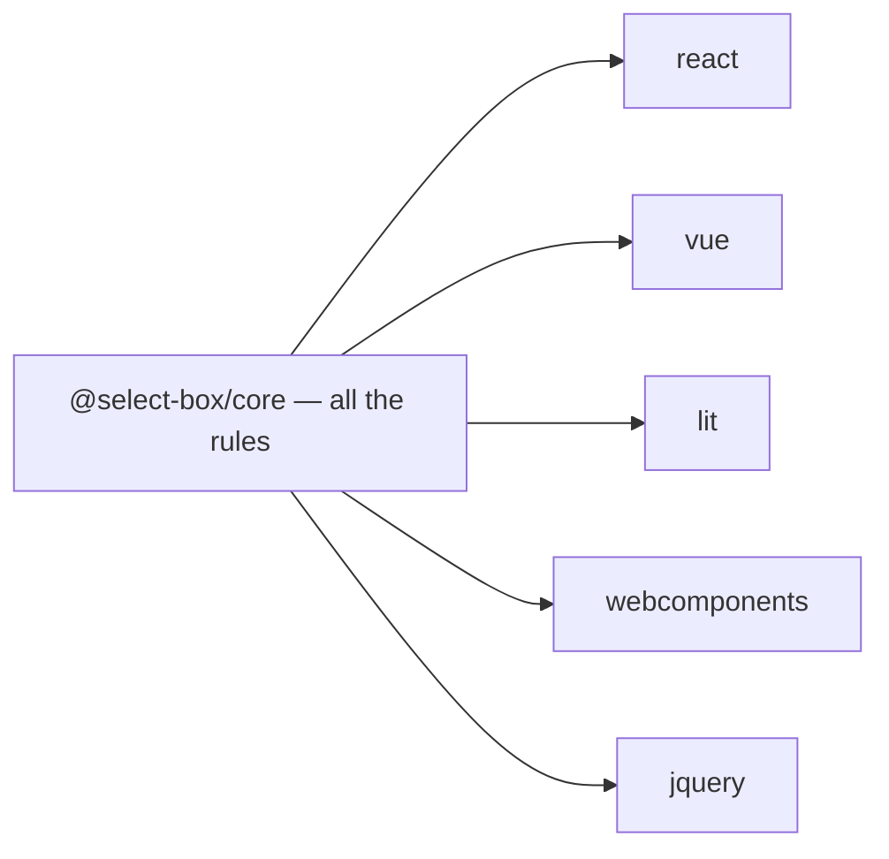

# 1. Every business rule lives in the core

- Status: accepted

## Context

Five wrappers means five chances to answer the same question differently. Any
rule a wrapper is allowed to hold is a rule that will eventually differ between
React and jQuery.

## Decision

`@select-box/core` owns **every** rule: what is selectable, what a commit does,
what filtering means, what each key does, what ARIA announces, when interaction
is refused. A wrapper may only *translate* — render the snapshot, forward the
gesture. No framework type enters the core, no rule leaves it.

## Consequences

- A behaviour fix is one commit, and every wrapper has it.
- If a wrapper needs a rule to do its job, the rule is missing from the core.
  That is the signal to move it down, not to write it locally.
- Wrappers stay small enough to read in one sitting.
- Server-side rendering is out of scope: the core is client state.
