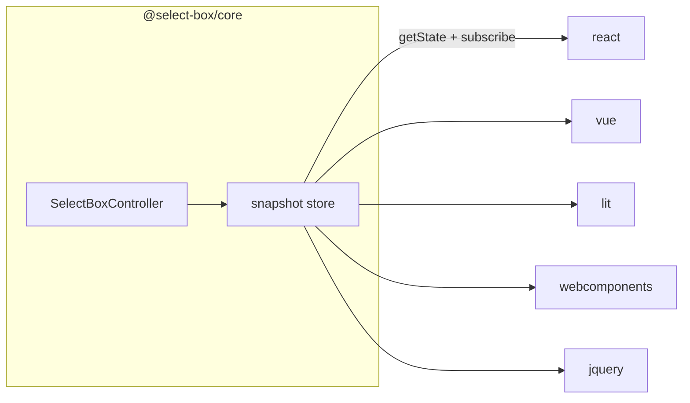

# 1. A framework-agnostic core with thin wrappers

- Status: accepted
- Date: 2026-08-26

## Context

A select box is mostly behaviour: search, filtering, keyboard navigation,
virtualization, ARIA wiring, open/close state. Almost none of that is
framework-specific, yet every mainstream library re-implements all of it per
framework. A stack that mixes React with a Vue widget and some legacy jQuery
therefore ships three select boxes with three sets of UX bugs.

## Decision

State and behaviour live in `@select-box/core` as a plain TypeScript
controller exposing an observer store — `getState()` returns an immutable
snapshot, `subscribe(listener)` returns an unsubscribe function. Every
framework package is a thin adapter that subscribes and renders the snapshot.
No framework type reaches the core, and no behaviour lives in a wrapper.

That shape is exactly what each framework already consumes: React's
`useSyncExternalStore`, Vue's `customRef`, Lit's `ReactiveController`, and a
`requestUpdate()` call in the two custom elements.

Snapshot field names are identical everywhere — `mode`, `open`, `query`,
`value`, `selectedOption`, `selectedOptions`, `filteredGroups`, `activeIndex`,
`activeOption`, `isEmpty`, `highlightRanges`, `addons`. Tests assert on those
names directly, so a wrapper that renames one fails.

## Consequences

- A behaviour fix lands once and reaches all five wrappers.
- Cross-wrapper drift becomes a test failure rather than a support ticket
  (see [ADR 9](0009-layer-the-test-suites.md)).
- `getState()` must return a stable reference when nothing changed, or every
  wrapper re-renders on every event.
- Anything a framework does better than us — reconciliation, scheduling — stays
  the wrapper's job. The core never schedules; listeners fire synchronously
  after the mutation completes.
- Server-side rendering is out of scope for now: the core is client state.
