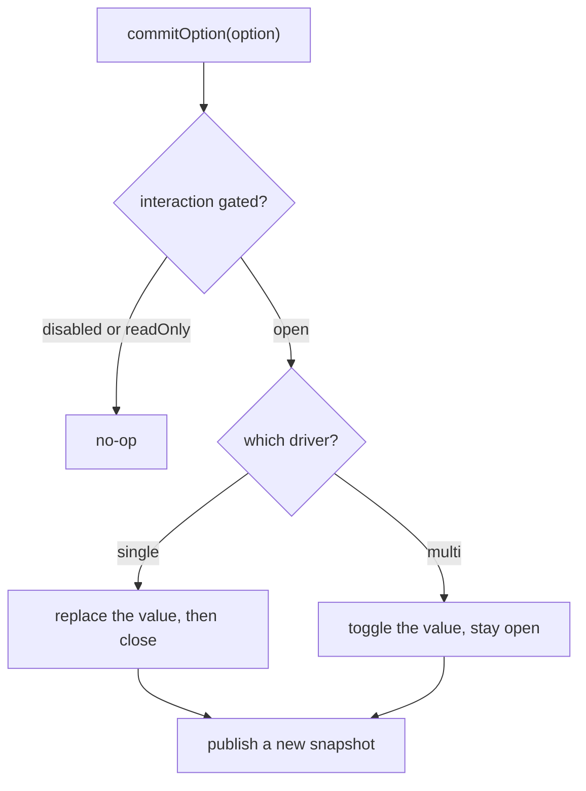

# 2. One controller, with cardinality behind a pluggable driver

- Status: accepted
- Date: 2026-08-26

## Context

Single-select and multi-select differ in surprisingly little: whether a commit
replaces or toggles the value, whether the popover closes afterwards, and
whether the value is a string or a list. Everything else — filtering,
navigation, ARIA, virtualization — is identical. The original implementation
carried two full controllers, and they had already drifted.

## Decision

One `SelectBoxController` owns all shared behaviour. Cardinality is delegated
to an injected `SelectionDriver` with a small contract: `empty`, `coerce`,
`commit`, `contains`, `keys`, plus a `closeOnCommit` flag and a `mode` label.

Drivers are pure transformers — they receive the current value and return the
next one. They never hold a reference back to the controller.

`SingleSelectBoxController` and `MultiSelectBoxController` survive as
three-line subclasses that preset `mode` and fix the value generic, so code
importing them keeps compiling.

Two adjacent decisions ride along:

- **`value` is always a string**, mirroring `<option value>`. It makes identity
  comparison, form serialization and the internal value-to-option index
  trivial. Domain payload rides alongside through the `TExtra` generic and
  comes back untouched in `selectedOption` / `onChange`.
- **Refusing interaction lives in the controller**, as one
  `setInteractivity({ disabled, readOnly })` gate in front of every mutator.
  The per-wrapper guards this replaced had already drifted apart.

## Consequences

- `setMode` can flip cardinality at runtime: it swaps the driver and coerces
  the held value through it.
- A future cardinality — a tags-style mode, say — is a third driver, not a
  third controller.
- Both `selectedOption` and `selectedOptions` are always published, so
  mode-agnostic consumer code reads whichever shape it prefers.
- Numeric option values are silently coerced to strings. Consumers that need
  the number back read it off `TExtra`.
