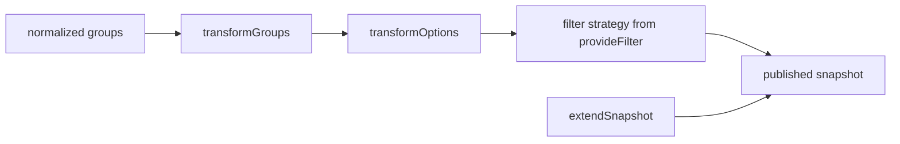

# 3. Addons are pure transformers, never holders of the controller

- Status: accepted
- Date: 2026-08-26

## Context

Everything beyond "commit an option" is optional: fuzzy matching, pinning the
selection to the top, an `Add "…"` row, a clear button, persistence. Bundling
all of it bloats the core for consumers who wanted a select box. The obvious
extension shape — hand each addon the controller and let it call methods — is
also the shape that makes reentrancy possible: an addon mutating state from
inside a hook that state changes triggered.

## Decision

Addons register through a chainable `.use(new Addon(config))` and ship as their
own packages, so consumers install what they use. Every hook is either a **pure
transformer** of read-only data or a **provider** the core composes. No hook
ever receives a mutable controller reference, which makes reentrancy
structurally impossible rather than guarded against.

Hooks compose in registration order. An addon that must *change* state returns
a description of the change — `interceptCommit` returns a replacement option or
`null` to veto, `onKeyDown` returns an `AddonKeyEffect` — and the core applies
it through the same gated methods a user gesture goes through.

`packages/core/tests/arch/addon-contract.test.ts` locks the exact member set, so
a refactor cannot widen the published contract by accident.

Snapshot extension is typed by declaration merging, the way TanStack Table does
it: each addon augments `SelectBoxAddonSnapshots`, so
`snapshot.addons["hoist-selected"]` is typed by installing the package.

## Consequences

- An addon that needs to add an option takes a callback in its **config**
  instead of reaching for the controller. The consumer owns the option list, so
  the consumer is who calls `setOptions`.
- `attach()` and `detach()` take no arguments — they exist for side effects the
  addon owns itself, like timers and external listeners.
- Restoring persisted state cannot be the addon's job. `@select-box/addon-persist`
  writes on change, and hands restoration back as an `initialValue` the consumer
  passes in — which also puts the restore inside the first snapshot instead of
  flashing an empty box.
- Two addons render an affordance rather than transforming data. Rather than
  teach five wrappers an addon's slice shape, `SelectBoxSnapshotView` resolves
  `clearControl` and `removeControl` once, falling back per field. Core honouring
  a slice by name is the coupling this costs.
