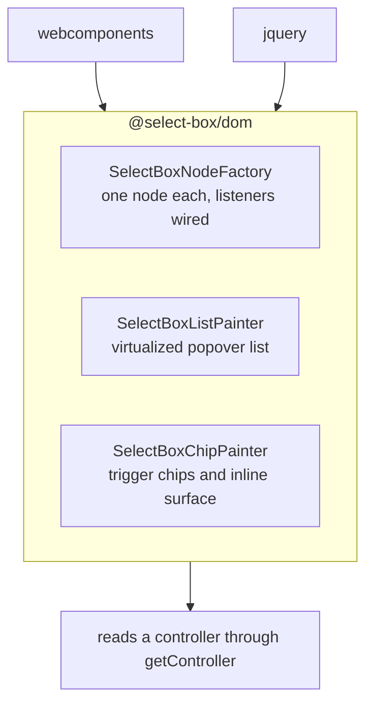

# 4. One set of light-DOM painters for the imperative wrappers

- Status: accepted
- Date: 2026-08-26

## Context

React, Vue and Lit paint from a template their framework reconciles. The web
component and the jQuery plugin build DOM by hand — and were building the same
DOM twice: the option row, the chip, the group header, the highlight chunking
and the whole virtualized list paint. Around 300 lines, duplicated, and already
diverged in two places.

## Decision

`@select-box/dom` owns that markup once, split by what changes for what reason:

The painters take no framework types and hold no reference to a host — a
`getController` accessor and a `refocus` callback are the entire contract — so
they are tested directly against a controller with no wrapper in the picture.

## Consequences

- The wrappers keep only what is genuinely theirs: attribute plumbing, form
  association, the key dispatcher, the surface toggle. Each dropped six state
  fields to the painters.
- Two real divergences died with the extraction, both in the web component: its
  inline surface rendered chips as bare siblings of the group headers where the
  other four wrap each group in a `[data-select-tags]` row, and its inline chips
  ignored `disabled` / `readOnly` entirely, so a disabled control still took
  clicks.
- The declarative wrappers deliberately do **not** use the painters. Making
  React render through imperative DOM would cost more than the duplication saves.
