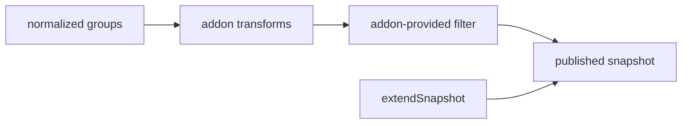

# 5. Addons change behaviour without touching the core

- Status: accepted

## Context

Everything past "commit an option" is optional: fuzzy matching, pinning the
selection, an `Add "…"` row, a clear button, persistence. Bundling all of it
bloats the library for consumers who wanted a select box — but the obvious
extension shape, handing each addon the controller, is also what makes an addon
able to trigger the very state change it is reacting to.

## Decision

Addons register with `.use(new Addon(config))` and ship as their own packages, so
consumers install only what they use. Every hook is a **pure transformer**: it
receives read-only data and returns new data. No hook ever holds the controller,
so reentrancy is impossible by construction rather than guarded against.

An addon that must *change* state returns a description of the change — a
replacement option, a veto, a key effect — and the core applies it through the
same gated path a user gesture takes.

Seven ship today: fuzzy, hoist selected, clear button, create option, remove
button, restore on backspace, persist.

## Consequences

- Hooks compose in registration order, and that order is asserted.
- An arch test locks the hook surface, so a refactor cannot widen the published
  contract by accident.
- An addon that renders an affordance is resolved once in the core snapshot view,
  so installing it lights the control up in all five wrappers without any of them
  depending on the addon package.
- An addon that needs to add an option takes a callback in its config: the
  consumer owns the option list, so the consumer is who updates it.
