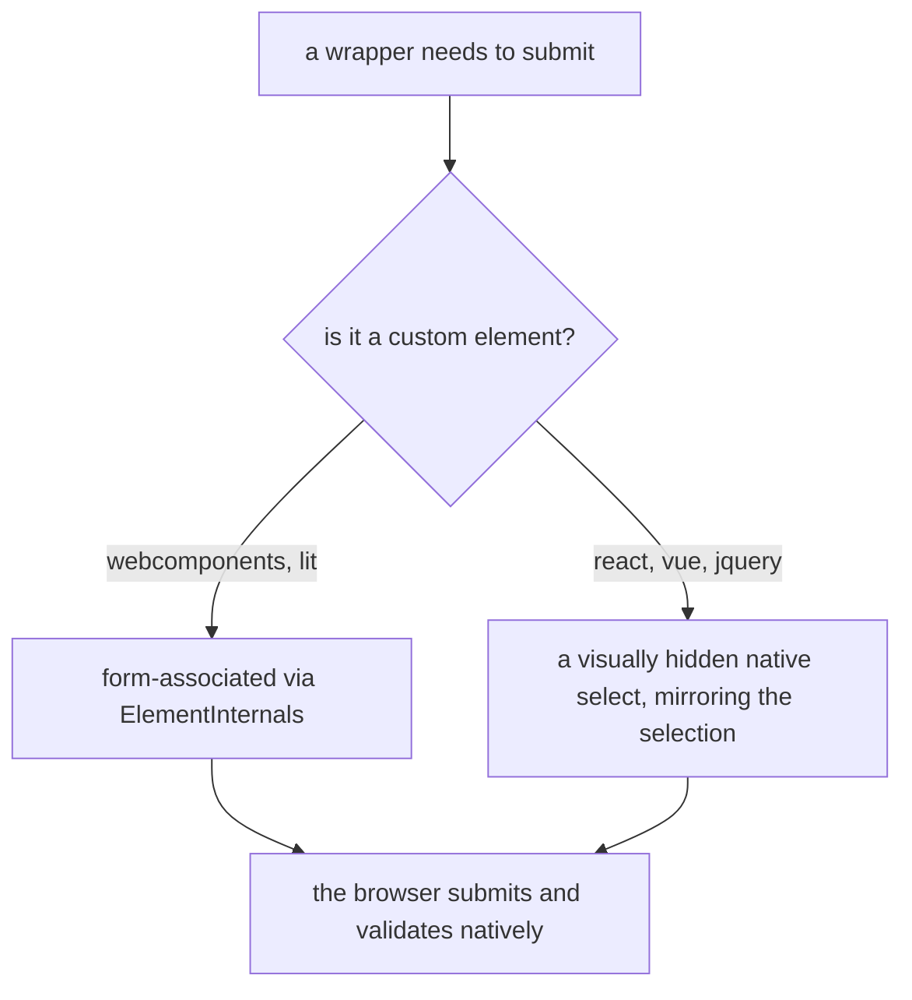

# 5. Reach forms through a real native control

- Status: accepted
- Date: 2026-08-26

## Context

A select box that a form cannot submit is a widget, not a form control.
Consumers expect `name`, `required`, submission, constraint validation,
`form.reset()` and autofill to behave the way they do on a `<select>` —
and none of that is worth reimplementing.

## Decision

Every wrapper offers what a native input offers: `disabled`, `readOnly`, `name`
and `required`. How it reaches the form splits by wrapper kind, with the same
observable result.

The mirror is the pattern Radix UI ships: `aria-hidden`, `tabindex="-1"`, real
`<option>` children, hidden with the visually-hidden values rather than
`display: none` — a control removed from layout cannot be focused, and the
browser then refuses a failed constraint validation without showing anything.

Unlike Radix, the mirror also handles `multiple`, which is what makes multi mode
submit one entry per selection like a native `<select multiple>`.

## Consequences

- Nothing about submission or validation is reimplemented. The browser sees a
  native control.
- `disabled` and `readOnly` both refuse interaction in the controller; they
  differ outside it exactly as the native attributes do, in whether the control
  is focusable and whether it submits.
- The mirror is an extra node in the tree that consumers will see in devtools.
- Form reset needed its own decision, because the browser resets the mirror on
  its own terms — see [ADR 6](0006-restore-the-default-on-form-reset.md).
