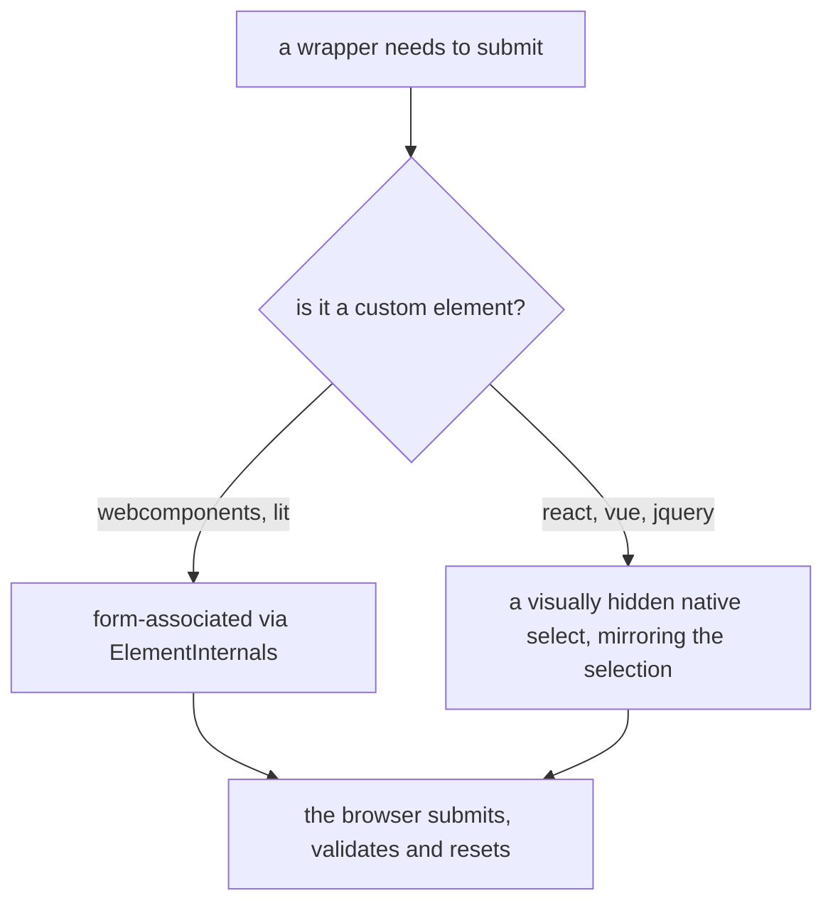

# 6. Behave like a native form control

- Status: accepted

## Context

A select box a form cannot read is a widget, not a form control. Consumers expect
`FormData` to pick the value up, `required` to block submission, and
`form.reset()` to do what it does everywhere else — and none of that is worth
reimplementing badly.

## Decision

Every wrapper offers `disabled`, `readOnly`, `name` and `required`, and reaches
the form through a **real native control** so the browser does the work.

`form.reset()` restores **the default the box was built with**, not empty —
exactly like a native `<select>`. `clear()` is the other operation, the one a
user gesture triggers, and it does empty.

## Consequences

- `FormData` sees a native control, so submission, validation, `required` and
  autofill are the browser's behaviour, not our imitation of it.
- Multi mode submits one entry per selection, like `<select multiple>`.
- The default is re-resolved against the options loaded at reset time, so a
  default whose option was removed resolves to empty and one that arrives later
  starts working.
- The mirror is an extra hidden node consumers will see in devtools.
- `reset()` deliberately ignores `disabled` / `readOnly`, because the platform
  resets those controls too.
