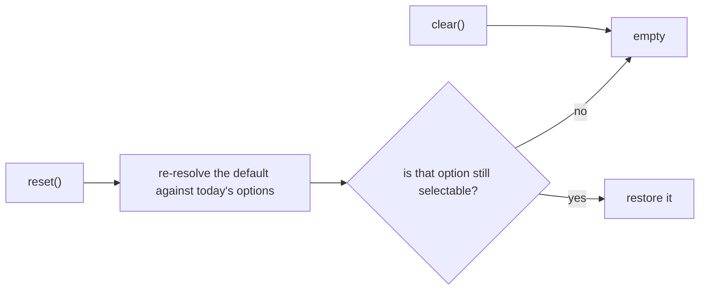

# 6. Form reset restores the default, it does not empty

- Status: accepted
- Date: 2026-08-26

## Context

The widget used to treat `form.reset()` as "clear the selection". A native
`<select>` does not: reset returns the control to the value its markup declared,
not to empty. Consumers who set a `defaultValue` and then reset the form got an
empty box, which is the one thing reset is supposed not to do.

## Decision

`reset()` and `clear()` are different operations, and only one of them is a user
gesture.

| Call | Result | Refused while disabled or readOnly |
|---|---|---|
| `controller.clear()` | empty | yes |
| `controller.reset()` | the default it was built with | no |

`reset()` deliberately bypasses the interaction gate, because a form reset is
not a user interaction and the platform resets read-only and disabled controls
too.

The default is stored as handed in and **re-resolved against the options loaded
at reset time**, the way a native control's default lives in its markup rather
than in a snapshot taken at startup.

## Consequences

- This was a breaking change to `reset()` semantics, taken deliberately for
  platform parity.
- A default whose option has since been removed or disabled resolves to empty,
  and one whose option arrives later starts working.
- Making it true in a browser took more than core. The browser resets the
  mirrored `<select>` to its *attribute-defined* default, not to whatever
  property the wrapper last wrote, so setting `option.selected` alone loses the
  race. Each mirror now stamps `defaultSelected` onto whatever it currently
  shows, so the platform's reset and the controller's reset land on the same
  option whichever runs first. jQuery does the same for the trigger `<input>`
  and its `defaultValue`.
- Vue needs neither: its render flush lands after the reset algorithm, so its
  repaint is already the last word. Rather than keep an untestable guard, it
  does without.
- The two custom elements sidestep all of it through `formResetCallback`.
