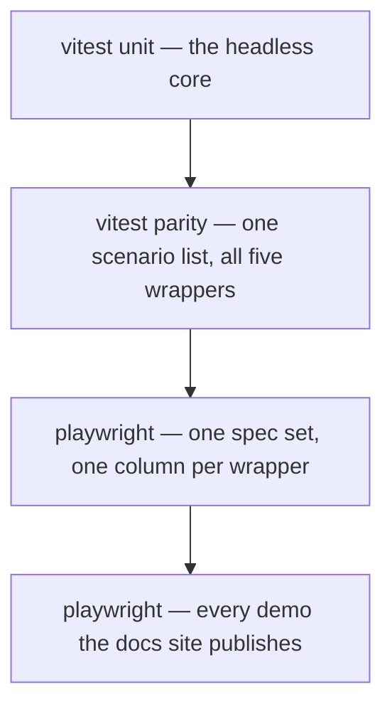

# 8. Tests prove every wrapper has every feature

- Status: accepted

## Context

Writing each wrapper's suite by hand guarantees they diverge, and the wrapper
that quietly lacks a test is the wrapper that quietly lacks the feature. Running
everything in a real browser is honest but far too slow for every change.

## Decision

Two matrix suites, one scenario list each, both run per wrapper as columns.

Each wrapper supplies only a mount-and-interact handle; the shared suite drives
it. Adding a scenario adds it to all five at once, and a wrapper that cannot
satisfy it fails loudly instead of quietly lacking the test.

Assertions go through the `data-select-*` contract, never through CSS classes or
framework internals — that is what lets one spec address five renderers. The
browser layer exists for what JSDOM cannot answer: real CSS visibility, focus,
popover layout, 10 000-option virtualization, form submission, teardown, and the
accessibility tree the browser itself computes.

## Consequences

- A core regression turns every column red at once; a wrapper regression turns
  only its own. The failure names the layer.
- Browser fixtures import the **built** packages, so that layer tests what a
  consumer installs.
- Which columns a change must run is decided by tested code rather than a YAML
  path filter, because a misrouted filter under-tests silently.
- Interaction dispatch stays per-adapter — React needs act, Lit needs
  `updateComplete`, Vue needs `nextTick`. Only the assertions are shared.
