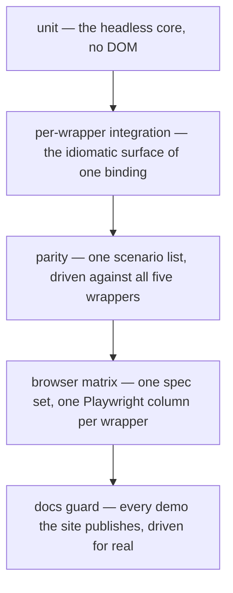

# 9. Layer the suites, and pin cross-wrapper behaviour in one list

- Status: accepted
- Date: 2026-08-26

## Context

Five wrappers multiply every testing choice by five. Writing each wrapper's
suite by hand guarantees they diverge — the wrapper that quietly lacks a test is
the wrapper that quietly lacks the behaviour. Running everything in a real
browser instead is honest but far too slow to run on every change.

## Decision

Five layers, cheapest first, each answering what the layer below cannot.

The parity layer is the load-bearing one. Each wrapper supplies only a
`ParityHandle` — mount, query root, public root, settle, and the interaction
verbs — and the shared suite drives it. Adding a scenario adds it to all five at
once; a wrapper that cannot satisfy it fails loudly instead of quietly lacking
the test.

Assertions run through the `data-select-*` attribute contract, never through
framework internals or CSS classes, which is what lets one spec address five
rendering models. Two rules keep it grading behaviour rather than implementation:
**presence or `hidden` both count as absent**, since a user cannot see or click
either; and **applicability belongs in the DOM, not only in CSS**, because state
that exists only as a CSS rule is unassertable outside a browser.

The browser matrix exists for what JSDOM cannot answer: real CSS visibility,
keyboard and focus, popover layout and paint order, virtualization over 10 000
options, teardown, form submission, and the accessibility mapping the browser
itself computes.

## Consequences

- A core regression turns every column red at once; a wrapper regression turns
  only its own. The failure names the layer.
- The browser fixtures import the **built** packages, so that layer tests what a
  consumer installs. `e2e` depends on `build` for exactly that reason.
- Interaction dispatch stays the adapter's job — React needs act-wrapped
  helpers, Lit needs `updateComplete`, Vue needs `nextTick`. Only assertions are
  shared, because that is where parity lives.
- The suites are audited by mutation: a regression is introduced on purpose and
  the matrix has to catch it. That sweep is what turned up two specs that could
  not fail.
- A stylesheet arch test asserts set equality both ways between the classes the
  wrappers emit and the rules the sheet declares, after two class names shipped
  with no rule at all.
