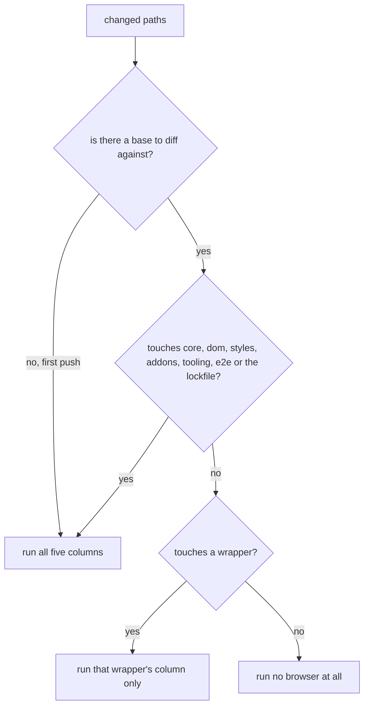

# 10. Decide the E2E scope in tested code, not in YAML

- Status: accepted
- Date: 2026-08-26

## Context

Running five browser columns on every push is most of the CI bill, and most of
it is waste: a change to the Vue wrapper cannot break the jQuery column. The
usual fix is a `paths` filter in the workflow — but a misrouted filter
*under-tests silently*, which is the one CI failure mode that looks like success.

## Decision

Which columns a change must run is a decision, so it lives in `@select-box/ci`
as a tested function that the workflow calls, rather than as a YAML expression.

An unknown diff is treated as shared, so the failure mode is over-testing.

## Consequences

- A wrapper-only change pays for one browser run instead of five; a prose-only
  change pays for none.
- The routing has 22 tests of its own, and a routing bug is a red test rather
  than a green pipeline.
- The workflow gains a `scope` job whose only output is the matrix, so the
  matrix is data rather than a hardcoded list.
- CI keeps `retries: 1`, so a flake stays visible as a retry rather than hidden
  as a pass. A characterisation sweep of 1697 browser test executions with
  retries disabled produced zero failures.
